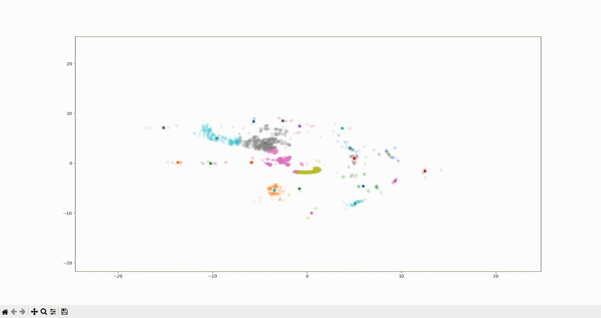
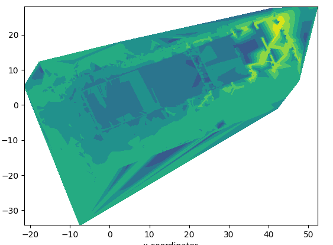
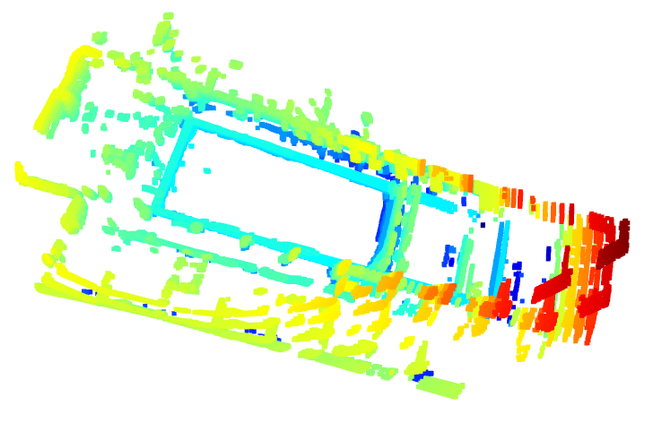
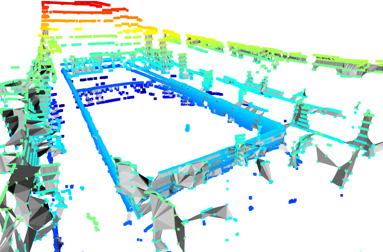

# LIDAR WATER SURFACE PROCESSING :

usage: LIDAR Data Processing [-h] [--lidar_vel LIDAR_FILE_PATH NUM_FRAME_TO_EXTRACT] [--lidar_ous LIDAR_FILE_PATH JSON_META_FILE_PATH NUM_FRAME_TO_EXTRACT] [--gyro CSV_FILE_PATH] [--corr YPR_OPTION] [--prefilter JSON_FILE_PATH]
                             [--postfilter JSON_FILE_PATH] [--display DISPLAY_TYPE]

Process LIDAR wave surface data

options:
-  -h, --help            show this help message and exit
-  --lidar_vel LIDAR_FILE_PATH NUM_FRAME_TO_EXTRACT :
                        read Velodyne lidar .pcap
-  --lidar_ous LIDAR_FILE_PATH JSON_META_FILE_PATH NUM_FRAME_TO_EXTRACT :
                        read Ouster lidar .pcap
-  --gyro CSV_FILE_PATH : read IMU csv file
-  --corr YPR_OPTION  :   correct the point cloud with IMU data (Yaw, Pitch, Roll)
-  --prefilter JSON_FILE_PATH :
                        filter cloud point before correcting the data
-  --postfilter JSON_FILE_PATH :
                        filter cloud point after correcting the data
-  --display DISPLAY_TYPE :
                        display data : pc (point cloud), mesh (mesh generation)
---
## Baril Point Wave Cluster

Clusturize wave in 2d and find center point to see their movement

## Contour lidar

Generate MathPlot contour animation from lidar data

## Point Cloud Lidar

Visualise Point cloud in a Open3d Space

## Point Cloud Stabilisation

Stabilise the point cloud with IMU data

## Mesh Generation

Generate Mesh From Lidar Point cloud and Visualise it

