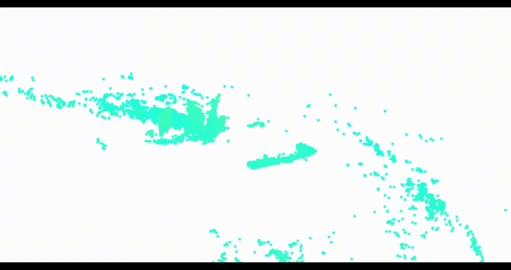
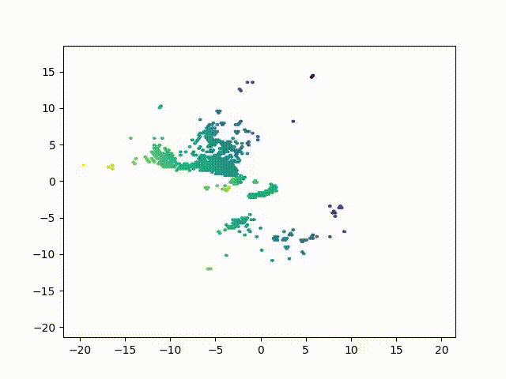
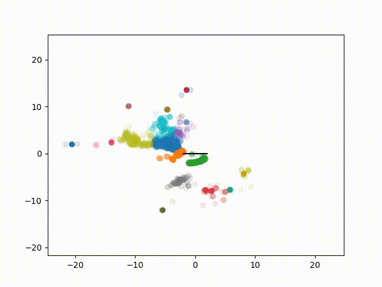
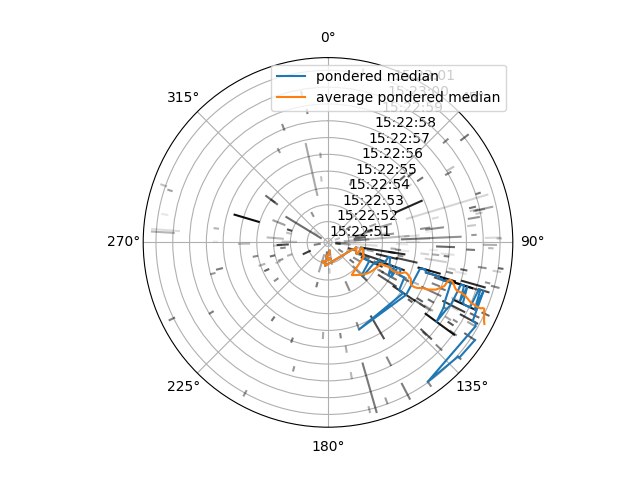
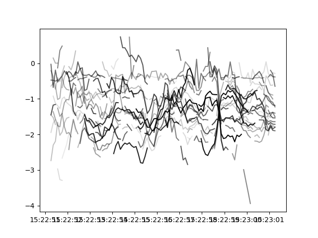

# LIDAR WATER SURFACE PROCESSING :

Experimental Python Module

Analyse a Lidar Scan "film" of a water surface (mainly the ocean) to determine informations about it, mainly the direction of the waves

```
options :
  -h, --help            show this help message and exit
  --lidar_vel LIDAR_FILE_PATH NUM_FRAME_TO_EXTRACT
                        read Velodyne lidar .pcap
  --lidar_ous LIDAR_FILE_PATH JSON_META_FILE_PATH NUM_FRAME_TO_EXTRACT
                        read Ouster lidar .pcap
  --simu SEA_TYPE NBR_FRAMES
                        Generate a simulated sea
  --gyro CSV_FILE_PATH  read IMU csv file
  --corr YPR_OPTION     correct the point cloud with IMU data (Yaw, Pitch, Roll)
  --prefilter JSON_FILE_PATH
                        filter cloud point before correcting the data
  --postfilter JSON_FILE_PATH
                        filter cloud point after correcting the data
  --display DISPLAY_TYPE
                        display data : pc (point cloud), mesh (mesh generation), hex2d (hex top view), barycentre (barycentre of knn clusterisation of the pc), linebary (line of barycentre movement), wavedir
                        (estimated direction of the wave), wavepolar (polar of the estimated direction of the wave), waveheight (average height of each cluster)
```
---
# INSTALATION GUIDE
Make sure you have Python 3.10.4 or higher

Clone the repo
```
git clone https://github.com/MalCaor/LidarWaterSurfaceProcessing
```
Enter the Folder
```
cd LidarWaterSurfaceProcessing
```
Install required dependency from the 'setup.py' file
```
pip install .
```
**OR** use the Conda environement
```
conda env create --file=Conda/env.yaml
```
Test if it's working with
```
python ./LidarDataProc/LidarDataProc.py --help
```
If the help message is displayed (can take a few seconds for the modules to import), Congratulation!

You can then take your .pcap file and try to display things as bellow!

# Display Type :
## PC

Just visualise the lidar data in open3d as a moving point cloud



## Mesh

Generate a mesh from the point cloud


## Hex2d

Display the point cloud as a 2d animation view from the top



# Barycentre

Display the animated barycentre of a KNN clustering


# Linebary

Display the barycentre movement as lines
Lines go from blue to red according to their lenght


# Wavedir

Same as linebary but with the estimated direction of the wave (weighted average of the linear reduction of the lines)



# WavePolar

Polar graph of the estimated direction of the wave



# WaveHeight

average wave height of each line cluster, alpha varying according to the ponderation weight


